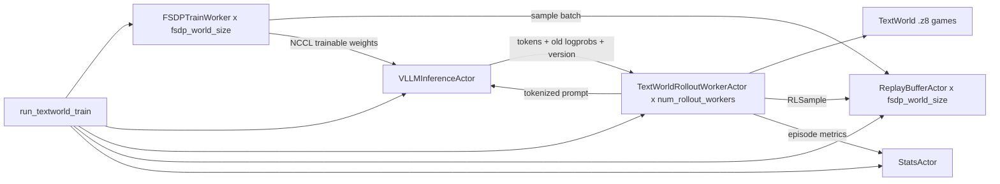

# AcceRL-Agent

AcceRL-Agent is a asynchronous framework for online reinforcement learning with language-model agents. The main example in this repository is a TextWorld training loop: the model samples actions online through vLLM, the environment returns rewards, an FSDP trainer asynchronously consumes rollout samples, and updated weights are hot-synced back into vLLM.

Main entry point:

```text
accerl_agent/agent_textworld.py
```

End-to-end loop:

```text
TextWorld episode -> vLLM action generation -> environment step -> RLSample
       -> Replay Buffer -> FSDP trainer parameter update
       -> NCCL weight sync -> vLLM samples with newer weights
```

If you only want to run the smallest working flow first, see [QUICKSTART.md](QUICKSTART.md).

## Features

- TextWorld environment rollout.
- Online vLLM inference and action sampling.
- Distributed PyTorch FSDP training.
- Asynchronous replay buffer for caching and reusing training samples.
- Trainer-side token-budget packing with FlashAttention 2 varlen attention.
- Response-only LM-head projection through the model-native `logits_to_keep` API.
- NCCL weight transfer from FSDP to vLLM.
- PPO/GRPO-style rollout advantage construction.

## Repository Layout

| Path | Description |
| --- | --- |
| `accerl_agent/agent_textworld.py` | Full Ray + vLLM + FSDP online RL training entry point. |
| `accerl_agent/textworld_local_infer.py` | Checks vLLM inference and TextWorld environment interaction without training. |
| `accerl_agent/local_trainer.py` | Local dummy SFT smoke test for tokenizer/model/FSDP training paths. |
| `accerl_agent/vllm_*.py` | Experimental scripts for vLLM, NCCL, and rollout-engine work. |
| `QUICKSTART.md` | Minimal run path, recommended scaling order, and troubleshooting checklist. |

## Requirements

This project targets Linux GPU environments. Exact package versions must match your CUDA, PyTorch, and vLLM stack. The main training path requires at least:

- Python >=3.10,<3.15. Python 3.10 is recommended for conda environments.
- NVIDIA GPUs and a CUDA-enabled PyTorch build.
- PyTorch with FSDP2 support.
- vLLM with the weight-transfer API around `WeightTransferConfig`.
- Ray, Transformers, TensorBoard, and TextWorld.
- A local HuggingFace Causal LM model directory.
- TextWorld `.z8` game files.

Several parts of the current code assume a model layout close to Qwen/Qwen-MoE, such as `model.model.layers` and `lm_head`. If you use another HuggingFace model family, carefully check `build_model()`, `configure_trainable_parameters()`, the FSDP wrapping path, and `iter_vllm_loadable_weights()`.

The optional varlen path additionally requires a GPU-supported `flash-attn`
build and a Transformers model that implements tensor `logits_to_keep`.
Transformers 5.12.1 with Qwen/Qwen-MoE is the currently verified combination.
Other Transformers versions or model classes may not support this API.

## Installation

The repository is not packaged as a pip package yet. Run scripts directly from the repository root.

```bash
git clone <REPO_URL>
cd AcceRL-Agent

conda create -n accerl-agent python=3.10 -y
conda activate accerl-agent
python -m pip install --upgrade pip setuptools wheel ninja packaging

python -m pip install torch==2.11.0
python -m pip install --no-build-isolation -r requirements.txt

python -c "import flash_attn, ray, torch, transformers, vllm; print('torch', torch.__version__, 'cuda', torch.version.cuda); print('transformers', transformers.__version__); print('vllm', vllm.__version__); print('flash-attn', flash_attn.__version__); print('ray', ray.__version__)"
```

The required stack uses PyTorch 2.11.0, Transformers 5.12.1, vLLM 0.21.0 or
newer, FlashAttention 2.8.3.post1, and Ray 2.56.0. The current local
environment uses vLLM 0.24.0. Install PyTorch first because FlashAttention
imports it while building, and keep `--no-build-isolation` on the requirements
installation command. These packages are tightly coupled to CUDA; update the
related pins together when using a different cluster-provided stack.

## Quickstart

Set the model and TextWorld game paths first:

```bash
export MODEL_PATH=<LOCAL_HF_MODEL_PATH>
export TEXTWORLD_GAME_DIR=<TEXTWORLD_Z8_GAME_DIR>
```

First, run the local multi-trainer smoke test. It does not depend on vLLM or TextWorld; it only checks tokenizer/model loading, response-only labels, Ray FSDP multi-trainer initialization, forward/backward, and optimizer steps. The example below starts 2 FSDP trainers and needs at least 2 visible GPUs.

```bash
python accerl_agent/local_trainer.py \
  --model-path "$MODEL_PATH" \
  --train-mode lm_head \
  --use-fsdp \
  --fsdp-world-size 2 \
  --max-steps 5 \
  --batch-size 1 \
  --max-length 128 \
  --trust-remote-code
```

Second, run local TextWorld inference without training:

```bash
python accerl_agent/textworld_local_infer.py \
  --model-path "$MODEL_PATH" \
  --game-dir "$TEXTWORLD_GAME_DIR" \
  --game-pattern "*.z8" \
  --episodes 2 \
  --game-limit 2 \
  --max-episode-steps 10 \
  --num-samples 1 \
  --tensor-parallel-size 1 \
  --max-model-len 4096 \
  --vllm-max-num-seqs 4 \
  --vllm-max-num-batched-tokens 2048
```

Third, run a tiny end-to-end RL loop. The command below uses 1 FSDP GPU and 1 vLLM GPU, so it needs at least 2 visible GPUs:

```bash
python accerl_agent/agent_textworld.py \
  --model-path "$MODEL_PATH" \
  --tw-game-dir "$TEXTWORLD_GAME_DIR" \
  --tw-game-pattern "*.z8" \
  --tw-game-limit 2 \
  --tw-max-episode-steps 10 \
  --tw-history-token-window 1024 \
  --max-length 1024 \
  --fsdp-world-size 1 \
  --infer-size 1 \
  --infer-tp-size 1 \
  --num-rollout-workers 1 \
  --rollout-batch-size 1 \
  --batch-size 1 \
  --grad-accum-steps 1 \
  --replay-capacity 8 \
  --min-replay-size-per-rank 1 \
  --max-steps 2 \
  --max-sync-rounds 1 \
  --sync-every-optimizer-steps 1 \
  --train-mode lm_head \
  --rl-algorithm ppo \
  --clip-mode ppo \
  --trust-remote-code
```

The command above deliberately uses the default padded trainer path. After it
passes, validate varlen training with:

```bash
python accerl_agent/agent_textworld.py \
  --model-path "$MODEL_PATH" \
  --tw-game-dir "$TEXTWORLD_GAME_DIR" \
  --tw-game-pattern "*.z8" \
  --tw-game-limit 2 \
  --tw-max-episode-steps 10 \
  --tw-history-token-window 1024 \
  --max-length 1024 \
  --fsdp-world-size 1 \
  --infer-size 1 \
  --infer-tp-size 1 \
  --num-rollout-workers 1 \
  --rollout-batch-size 2 \
  --batch-size 2 \
  --grad-accum-steps 1 \
  --replay-capacity 8 \
  --min-replay-size-per-rank 2 \
  --max-steps 2 \
  --max-sync-rounds 1 \
  --sync-every-optimizer-steps 1 \
  --train-mode lm_head \
  --rl-algorithm ppo \
  --clip-mode ppo \
  --train-packing varlen \
  --train-token-budget 2048 \
  --train-pack-candidate-pool-size 8 \
  --train-logprob-mode response_only_lm_head \
  --dtype bfloat16 \
  --trust-remote-code
```

Replay continues to store independent `RLSample` objects. Each trainer rank
selects at most `--batch-size` samples and packs no more than
`--train-token-budget` real tokens into one micro-batch. The token budget must
be at least `--max-length`. Position IDs restart at zero for every sample so
Transformers FlashAttention 2 can infer sequence boundaries and prevent
cross-sample attention.

GPU requirement for full training:

```text
total GPUs >= fsdp_world_size + infer_tp_size * infer_size
```

Open TensorBoard:

```bash
tensorboard --logdir runs/TextWorld_FSDP
```

Each run writes `args.json`, `command.txt`, and TensorBoard event files under:

```text
runs/TextWorld_FSDP/<timestamp>
```

## Architecture

`agent_textworld.py` creates five main Ray actor types:



`FSDPTrainWorker` loads the tokenizer and `AutoModelForCausalLM`, selects trainable parameters according to `--train-mode`, and samples independent `RLSample` objects from replay. With `--train-packing varlen`, it dynamically packs those samples locally under the token budget. It computes the RL loss over response tokens and sends FSDP weights to vLLM during synchronization.

`VLLMInferenceActor` handles rollout inference. It starts vLLM with dummy weights, waits for the initial full weight sync, pauses generation during later syncs, aborts requests when needed, updates weights, and then resumes generation.

`TextWorldRolloutWorkerActor` is a CPU actor. It loads `.z8` games, builds prompts, asks vLLM to generate actions, parses actions, steps the environment, computes rewards, builds `RLSample` objects, and writes them to replay.

`ReplayBufferActor` stores samples sharded by FSDP rank. Rollout workers write to `replay_buffers[worker_id % fsdp_world_size]`, so `--num-rollout-workers` must be at least `--fsdp-world-size`.

`StatsActor` maintains sliding-window metrics and feeds TensorBoard with win rate, normalized score, invalid action rate, replay fill, reward, advantage, throughput, and sync-latency statistics.

## TextWorld Rollout

The TextWorld prompt includes the objective, observation, inventory, and admissible commands. It asks the model to return exactly one command. The parser:

1. Takes the first line of model output.
2. Removes common prefixes such as `action:`, `command:`, and `assistant:`.
3. Removes extra punctuation and quotes.
4. Lowercases and normalizes whitespace.
5. Exact-matches the normalized action against the current admissible commands.

`TextWorld/InvalidActionRate` is one of the most important early metrics. If it is high, first check the prompt, `--infer-max-tokens`, temperature, parser strictness, and whether the admissible commands are fully included in the prompt.

## Rewards and Algorithms

TextWorld step reward is computed in `_compute_step_reward()` from score deltas:

```python
reward = score_after - score_before - tw_step_penalty
if won:
    reward += tw_win_bonus
if lost:
    reward -= tw_lost_penalty
```

PPO mode is enabled with `--rl-algorithm ppo`. Each trajectory creates one episode-level `RLSample`; step rewards are assigned to response tokens, and token-level Monte Carlo returns are computed backward from the end of the episode.

GRPO mode is enabled with `--rl-algorithm grpo`. A group of full trajectories is sampled from the same game, then rewards are normalized within the group:

```python
advantage = (reward - group_mean) / (group_std + eps)
```

The training-side policy objective is controlled by `--clip-mode`:

- `ppo`: standard clipped surrogate using `--clip-eps`.
- `gipo`: log-ratio Gaussian soft clipping using `--gipo-sigma`.
- `sapo`: separate gate temperatures for positive and negative advantages using `--sapo-tau-pos` and `--sapo-tau-neg`.

## RLSample Contract

`RLSample` is the core protocol between the replay buffer and the trainer. Each sample must satisfy:

```text
len(input_ids) == len(attention_mask)
len(input_ids) == len(labels)
len(input_ids) == len(old_logprobs)
len(input_ids) == len(token_rewards)
len(input_ids) == len(token_advantages)
len(input_ids) == len(response_indices)
len(response_ids) == count(labels != -100)
len(output_versions) == len(response_ids)
```

The trainer computes loss only at positions where `labels != -100`. Prompt tokens, aborted outputs, and tokens that should not participate in training must keep label `-100` and must not be included in `response_ids` or `output_versions`.

## Important Arguments

| Argument | Description |
| --- | --- |
| `--model-path` | Local HuggingFace model path. |
| `--dtype` | `auto`, `bfloat16`, `float16`, or `float32`. |
| `--train-mode` | `lm_head`, `last_layer`, or `full`; start with `lm_head` when bringing up a new run. |
| `--tw-game-dir` | Directory containing TextWorld `.z8` games. |
| `--tw-history-token-window` | Token limit for the episode transcript. |
| `--max-length` | Maximum trainer-side sequence length; must be at least `--tw-history-token-window`. |
| `--fsdp-world-size` | Number of FSDP trainer GPUs. |
| `--infer-size` | vLLM data-parallel size. |
| `--infer-tp-size` | vLLM tensor-parallel size. |
| `--num-rollout-workers` | Number of CPU rollout actors; must be at least `--fsdp-world-size`. |
| `--rollout-batch-size` | Episode batch size per rollout worker in PPO mode; also the default GRPO group size. |
| `--batch-size` | Samples per padded micro-batch, or the maximum number of `RLSample` objects in one varlen pack, per FSDP rank. |
| `--train-packing` | `padded` (default) or `varlen`; varlen removes trainer-side attention padding with FlashAttention 2. |
| `--train-token-budget` | Maximum real tokens in a varlen pack; required for varlen and must be at least `--max-length`. |
| `--train-pack-candidate-pool-size` | Replay candidate pool used for length-aware packing; defaults to four times `--batch-size`. |
| `--train-logprob-mode` | `full_logits_ce` baseline, or `response_only_lm_head` to project only response prediction positions through native `logits_to_keep`; the latter requires varlen. |
| `--grad-accum-steps` | Gradient accumulation steps. |
| `--replay-capacity` | Maximum number of samples in each replay buffer. |
| `--min-replay-size-per-rank` | Minimum replay size required before a trainer rank starts training. |
| `--sync-every-optimizer-steps` | Number of optimizer steps between vLLM weight syncs. |
| `--max-sync-rounds` | Maximum number of train/sync segments; useful for smoke tests. |
| `--save-checkpoint` | Save a HuggingFace-format model checkpoint. |
| `--checkpoint-every-sync-rounds` | Periodic checkpoint interval; `0` disables periodic saves. |

## Checkpoints

Enable checkpoint saving:

```bash
--save-checkpoint
```

Default output path:

```text
<log-dir>/checkpoints/latest
```

By default, periodic and final saves both overwrite `latest`. To keep `step-XXXXXX` directories, set:

```bash
--checkpoint-name ""
```

Saved checkpoint contents include model weights, config, tokenizer files, and `trainer_state.json`. Optimizer state and replay-buffer contents are not saved yet, so these checkpoints are mainly for inference/evaluation rather than full training resume.

## Key Metrics

| Metric | Meaning |
| --- | --- |
| `TextWorld/WinRate` | Episode win rate over the recent window. |
| `TextWorld/NormalizedScore` | Normalized score over the recent window. |
| `TextWorld/InvalidActionRate` | Fraction of invalid actions. |
| `TextWorld/EnvStepsMean` | Average number of valid environment steps per episode. |
| `Replay/FillRatio` | Replay-buffer fill ratio. |
| `Replay/TrainSampleTrainerVersionLagMean` | Version lag between training samples and the current trainer. |
| `Train/LossMeanAcrossRanks` | Average loss across FSDP ranks. |
| `Train/PackTokenUtilization` | Fraction of `--train-token-budget` occupied by real tokens in a varlen pack. |
| `Train/PackSampleCount` | Number of independent samples in a varlen pack. |
| `Train/PackMaxSequenceLength` | Longest sequence in the current varlen pack. |
| `Train/PackCpuMilliseconds` | CPU time spent selecting and constructing a pack. |
| `KL/OldNewK3TokenMean` | Token-level KL-style metric between old and new policies. |
| `Infer/TokensPerSec` | vLLM generation throughput. |
| `Sync/ElapsedSeconds` | Weight-sync latency. |

## Troubleshooting

If the trainer keeps waiting for replay, check `--num-rollout-workers`, `--min-replay-size-per-rank`, `--replay-capacity`, the TextWorld game path, and `TextWorld/InvalidActionRate`.

If many actions are invalid, lower the temperature, reduce `--infer-max-tokens`, enable more detailed rollout logs, and confirm that the parser matches the task output format.

If vLLM weight sync fails, check GPU counts, vLLM weight-transfer API support, the NCCL environment, the names/shapes/dtypes returned by `iter_vllm_loadable_weights()`, and whether the trainable parameter set is empty.

If loss or KL is unstable, lower the learning rate, reduce replay staleness, try `--ppo-normalize-advantages`, increase the KL penalty, and confirm that invalid, aborted, or empty outputs are not mistakenly labeled as trainable tokens.

If varlen model loading fails, verify that `flash_attn` imports in the trainer
environment, the model supports `flash_attention_2`, the dtype is `bfloat16`,
`float16`, or `auto`, and the model forward accepts a tensor
`logits_to_keep`. Use `--train-packing padded` with
`--train-logprob-mode full_logits_ce` as the correctness and compatibility
fallback.
