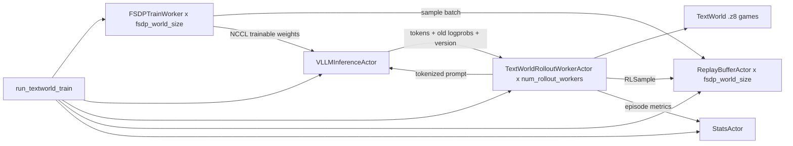

# AcceRL-Agent

AcceRL-Agent 是一个面向语言模型智能体在线强化学习的研究框架。当前主线示例是 TextWorld 任务：模型通过 vLLM 在线生成动作，环境返回奖励，FSDP trainer 异步消费 rollout 样本并训练，再把新权重热同步回 vLLM。

核心入口：

```text
accerl_agent/agent_textworld.py
```

整体闭环：

```text
TextWorld episode -> vLLM 生成动作 -> 环境执行 -> 构造 RLSample
       -> Replay Buffer -> FSDP trainer 更新参数
       -> NCCL weight sync -> vLLM 使用新权重继续采样
```

如果只想先跑通最小流程，请看 [QUICKSTART.md](QUICKSTART.md)。

## 功能特性

- TextWorld 环境 rollout。
- vLLM 在线推理和动作采样。
- PyTorch FSDP 分布式训练。
- Replay Buffer 异步缓存和复用训练样本。
- FSDP 到 vLLM 的 NCCL weight transfer。
- TensorBoard 记录 rollout、replay、training、inference 和 sync 指标。
- 支持 PPO/GRPO 风格的 rollout advantage 构造。

## 仓库结构

| 路径 | 说明 |
| --- | --- |
| `accerl_agent/agent_textworld.py` | 完整 Ray + vLLM + FSDP 在线 RL 训练入口。 |
| `accerl_agent/textworld_local_infer.py` | 只验证 vLLM 推理和 TextWorld 环境交互，不训练。 |
| `accerl_agent/local_trainer.py` | 本地 dummy SFT smoke test，验证 tokenizer/model/FSDP 训练路径。 |
| `accerl_agent/vllm_*.py` | vLLM、NCCL、rollout engine 相关实验脚本。 |
| `QUICKSTART.md` | 最小跑通流程、扩展顺序、排障清单。 |

## 环境要求

该项目面向 Linux GPU 环境。具体版本需要和你的 CUDA、PyTorch、vLLM 组合匹配，主训练链路至少需要：

- Python >=3.10,<3.15；建议 conda 环境使用 Python 3.10。
- NVIDIA GPU 和 CUDA 可用的 PyTorch。
- 支持 FSDP2 的 PyTorch。
- 支持 `WeightTransferConfig` 相关 weight transfer API 的 vLLM。
- Ray、Transformers、TensorBoard、TextWorld。
- 本地 HuggingFace Causal LM 模型目录。
- TextWorld `.z8` 游戏文件。

当前代码在多处默认模型结构接近 Qwen/Qwen-MoE，例如 `model.model.layers` 和 `lm_head`。如果换成其他 HuggingFace 模型，需要重点检查 `build_model()`、`configure_trainable_parameters()`、FSDP 包装位置和 `iter_vllm_loadable_weights()`。

## 安装

当前仓库还没有封装成 pip package，建议从仓库根目录直接运行脚本。

```bash
git clone <REPO_URL>
cd AcceRL-Agent

conda create -n accerl-agent python=3.10 -y
conda activate accerl-agent
python -m pip install --upgrade pip setuptools wheel

python -m pip install -r requirements.txt

python -c "import torch, vllm; print('torch', torch.__version__, 'cuda', torch.version.cuda); print('vllm', vllm.__version__)"
```

当前 `requirements.txt` 锁定了主链路验证目标：`vllm==0.21.0`、`torch==2.11.0`。vLLM 和 PyTorch/CUDA 版本强相关；如果集群已经提供验证过的 PyTorch 或 vLLM 模块，优先使用集群版本，并同步调整 `requirements.txt` 里的 `torch`/`vllm` 约束。

## 快速开始

先设置模型和 TextWorld 游戏路径：

```bash
export MODEL_PATH=<LOCAL_HF_MODEL_PATH>
export TEXTWORLD_GAME_DIR=<TEXTWORLD_Z8_GAME_DIR>
```

第一步，跑本地多 trainer smoke test。它不依赖 vLLM 和 TextWorld，只验证 tokenizer/model 加载、response-only labels、Ray FSDP 多 trainer 初始化、forward/backward 和 optimizer step。下面示例启动 2 个 FSDP trainer，需要至少 2 张可见 GPU。

```bash
python accerl_agent/local_trainer.py \
  --model-path "$MODEL_PATH" \
  --train-mode lm_head \
  --use-fsdp \
  --fsdp-world-size 2 \
  --max-steps 5 \
  --batch-size 1 \
  --max-length 128 \
  --trust-remote-code
```

第二步，跑 TextWorld 本地推理，不训练：

```bash
python accerl_agent/textworld_local_infer.py \
  --model-path "$MODEL_PATH" \
  --game-dir "$TEXTWORLD_GAME_DIR" \
  --game-pattern "*.z8" \
  --episodes 2 \
  --game-limit 2 \
  --max-episode-steps 10 \
  --num-samples 1 \
  --tensor-parallel-size 1 \
  --max-model-len 4096 \
  --vllm-max-num-seqs 4 \
  --vllm-max-num-batched-tokens 2048
```

第三步，跑一个很小的端到端 RL 闭环。下面命令使用 1 张 FSDP GPU 和 1 张 vLLM GPU，因此至少需要 2 张可见 GPU：

```bash
python accerl_agent/agent_textworld.py \
  --model-path "$MODEL_PATH" \
  --tw-game-dir "$TEXTWORLD_GAME_DIR" \
  --tw-game-pattern "*.z8" \
  --tw-game-limit 2 \
  --tw-max-episode-steps 10 \
  --tw-history-token-window 1024 \
  --max-length 1024 \
  --fsdp-world-size 1 \
  --infer-size 1 \
  --infer-tp-size 1 \
  --num-rollout-workers 1 \
  --rollout-batch-size 1 \
  --batch-size 1 \
  --grad-accum-steps 1 \
  --replay-capacity 8 \
  --min-replay-size-per-rank 1 \
  --max-steps 2 \
  --max-sync-rounds 1 \
  --sync-every-optimizer-steps 1 \
  --train-mode lm_head \
  --rl-algorithm ppo \
  --clip-mode ppo \
  --trust-remote-code
```

完整训练的 GPU 数量约束：

```text
total GPUs >= fsdp_world_size + infer_tp_size * infer_size
```

查看 TensorBoard：

```bash
tensorboard --logdir runs/TextWorld_FSDP
```

每次运行会在下面目录保存 `args.json`、`command.txt` 和 TensorBoard event 文件：

```text
runs/TextWorld_FSDP/<timestamp>
```

## 整体架构

`agent_textworld.py` 创建 5 类主要 Ray actor：



`FSDPTrainWorker` 负责加载 tokenizer 和 `AutoModelForCausalLM`，根据 `--train-mode` 选择可训练参数，从 replay 采样 `RLSample`，计算 response token 上的 RL loss，并在同步阶段把 FSDP 权重发送给 vLLM。

`VLLMInferenceActor` 负责 rollout 推理。它用 dummy weights 启动 vLLM，等待初始全量权重同步；后续同步时暂停 generation、abort 必要的请求、完成权重更新后恢复 generation。

`TextWorldRolloutWorkerActor` 是 CPU actor，负责加载 `.z8` 游戏、构造 prompt、请求 vLLM 生成动作、解析动作、执行环境 step、计算 reward、构造 `RLSample` 并写入 replay。

`ReplayBufferActor` 按 FSDP rank 分片保存样本。rollout worker 使用 `replay_buffers[worker_id % fsdp_world_size]` 写入，因此 `--num-rollout-workers` 必须不少于 `--fsdp-world-size`。

`StatsActor` 维护滑动窗口指标，并给 TensorBoard 提供 win rate、normalized score、invalid action rate、replay fill、reward、advantage、吞吐和同步耗时等统计。

## TextWorld Rollout

TextWorld prompt 包含 objective、observation、inventory、admissible commands，并要求模型只返回一条命令。parser 的流程是：

1. 取模型输出的第一行。
2. 去掉 `action:`、`command:`、`assistant:` 等常见前缀。
3. 去掉多余标点和引号。
4. lower 并压缩空白。
5. 与当前 admissible commands 归一化后精确匹配。

`TextWorld/InvalidActionRate` 是最重要的早期指标之一。如果它很高，优先检查 prompt、`--infer-max-tokens`、temperature、parser 严格度，以及 admissible commands 是否完整放进 prompt。

## Reward 与算法

TextWorld step reward 在 `_compute_step_reward()` 中基于 score 差值计算：

```python
reward = score_after - score_before - tw_step_penalty
if won:
    reward += tw_win_bonus
if lost:
    reward -= tw_lost_penalty
```

PPO 模式通过 `--rl-algorithm ppo` 启用。每条 trajectory 构造一条 episode-level `RLSample`，step reward 会分配到 response token，并从 episode 末尾向前计算 token-level Monte Carlo return。

GRPO 模式通过 `--rl-algorithm grpo` 启用。同一个游戏会采样一组完整 trajectory，并在组内做 reward 归一化：

```python
advantage = (reward - group_mean) / (group_std + eps)
```

训练侧 policy objective 由 `--clip-mode` 决定：

- `ppo`：标准 clipped surrogate，使用 `--clip-eps`。
- `gipo`：log-ratio Gaussian soft clipping，使用 `--gipo-sigma`。
- `sapo`：按 advantage 正负使用不同 gate temperature，使用 `--sapo-tau-pos` 和 `--sapo-tau-neg`。

## RLSample 协议

`RLSample` 是 replay buffer 和 trainer 之间的核心协议。每条样本必须满足：

```text
len(input_ids) == len(attention_mask)
len(input_ids) == len(labels)
len(input_ids) == len(old_logprobs)
len(input_ids) == len(token_rewards)
len(input_ids) == len(token_advantages)
len(input_ids) == len(response_indices)
len(response_ids) == count(labels != -100)
len(output_versions) == len(response_ids)
```

trainer 只在 `labels != -100` 的位置计算 loss。prompt token、被 abort 的输出、以及不想参与训练的 token 都应该保持 label 为 `-100`，并且不要放进 `response_ids` 或 `output_versions`。

## 重要参数

| 参数 | 说明 |
| --- | --- |
| `--model-path` | 本地 HuggingFace 模型路径。 |
| `--dtype` | `auto`、`bfloat16`、`float16` 或 `float32`。 |
| `--train-mode` | `lm_head`、`last_layer` 或 `full`，建议先用 `lm_head` 调通。 |
| `--tw-game-dir` | TextWorld `.z8` 游戏目录。 |
| `--tw-history-token-window` | episode transcript 的 token 上限。 |
| `--max-length` | trainer 侧最大序列长度，必须不小于 `--tw-history-token-window`。 |
| `--fsdp-world-size` | FSDP trainer GPU 数。 |
| `--infer-size` | vLLM data parallel size。 |
| `--infer-tp-size` | vLLM tensor parallel size。 |
| `--num-rollout-workers` | CPU rollout actor 数，必须不少于 `--fsdp-world-size`。 |
| `--rollout-batch-size` | PPO 模式每个 rollout worker 的 episode batch size，也是 GRPO group size 默认值。 |
| `--batch-size` | 每个 FSDP rank 的 micro batch size。 |
| `--grad-accum-steps` | 梯度累积步数。 |
| `--replay-capacity` | 每个 replay buffer 的最大样本数。 |
| `--min-replay-size-per-rank` | trainer rank 开始训练前需要的最小 replay 样本数。 |
| `--sync-every-optimizer-steps` | 每多少个 optimizer step 同步一次 vLLM 权重。 |
| `--max-sync-rounds` | 最大 train/sync segment 数，适合 smoke test。 |
| `--save-checkpoint` | 保存 HuggingFace 格式模型 checkpoint。 |
| `--checkpoint-every-sync-rounds` | 周期性保存间隔；`0` 表示不周期保存。 |

## Checkpoint

启用 checkpoint：

```bash
--save-checkpoint
```

默认保存路径：

```text
<log-dir>/checkpoints/latest
```

默认情况下，周期保存和最终保存都会覆盖 `latest`。如果想保留 `step-XXXXXX` 目录，设置：

```bash
--checkpoint-name ""
```

保存内容包括模型权重、config、tokenizer 文件和 `trainer_state.json`。当前不保存 optimizer state 或 replay buffer，因此主要用于推理/评估，不是完整 resume-training checkpoint。

## 关键指标

| 指标 | 含义 |
| --- | --- |
| `TextWorld/WinRate` | 最近窗口 episode 胜率。 |
| `TextWorld/NormalizedScore` | 最近窗口归一化分数。 |
| `TextWorld/InvalidActionRate` | 非法动作比例。 |
| `TextWorld/EnvStepsMean` | 每条 episode 平均合法环境步数。 |
| `Replay/FillRatio` | replay buffer 填充比例。 |
| `Replay/TrainSampleTrainerVersionLagMean` | 训练样本相对当前 trainer 的版本滞后。 |
| `Train/LossMeanAcrossRanks` | 多个 FSDP rank 的平均 loss。 |
| `KL/OldNewK3TokenMean` | old/new policy 的 token 级 KL 指标。 |
| `Infer/TokensPerSec` | vLLM 生成吞吐。 |
| `Sync/ElapsedSeconds` | 权重同步耗时。 |

## 常见问题

如果 trainer 一直等待 replay，检查 `--num-rollout-workers`、`--min-replay-size-per-rank`、`--replay-capacity`、TextWorld 游戏路径，以及 `TextWorld/InvalidActionRate`。

如果 invalid action 很多，降低 temperature，减小 `--infer-max-tokens`，打开更详细的 rollout 日志，并确认 parser 和任务输出格式一致。

如果 vLLM 权重同步失败，检查 GPU 数、vLLM weight-transfer API 支持、NCCL 环境、`iter_vllm_loadable_weights()` 的名字/shape/dtype，以及可训练参数是否为空。

如果 loss 或 KL 不稳定，降低学习率，减少 replay staleness，尝试 `--ppo-normalize-advantages`，增大 KL penalty，并确认非法、abort 或空输出没有被错误地设为可训练 token。
