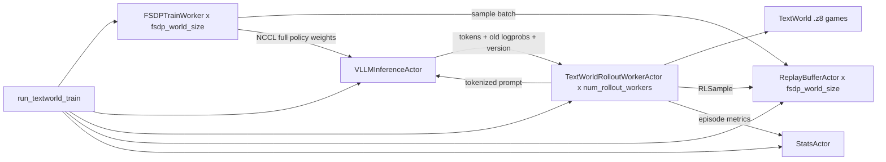

# AcceRL-Agent

AcceRL-Agent is an asynchronous framework for online reinforcement learning with language-model agents. The main example in this repository is a TextWorld training loop: the model samples actions online through vLLM, the environment returns rewards, an FSDP trainer asynchronously consumes rollout samples, and updated weights are hot-synced back into vLLM.

Canonical entry point:

```bash
python -m accerl_agent.run_agent_textworld --help
```

`accerl_agent/run_agent_textworld.py` is the Ray-safe launcher.
`accerl_agent/agent_textworld.py` contains the training implementation and is
not the documented direct entry point.

End-to-end loop:

```text
TextWorld episode -> vLLM action generation -> environment step -> RLSample
       -> Replay Buffer -> FSDP trainer parameter update
       -> NCCL weight sync -> vLLM samples with newer weights
```

If you only want to run the smallest working flow first, see [QUICKSTART.md](QUICKSTART.md).

## Features

- TextWorld environment rollout.
- Online vLLM inference and action sampling.
- Distributed PyTorch FSDP training.
- Asynchronous replay buffer for caching and reusing training samples.
- Trainer-side token-budget packing with FlashAttention 2 varlen attention.
- Response-only LM-head projection through the model-native `logits_to_keep` API.
- NCCL weight transfer from FSDP to vLLM.
- Raw token PPO replay with trainer-side current-value TD(λ), plus GRPO.

## Repository Layout

| Path | Description |
| --- | --- |
| `accerl_agent/run_agent_textworld.py` | Canonical launcher for Ray-safe TextWorld training startup. |
| `accerl_agent/agent_textworld.py` | Full Ray + vLLM + FSDP online RL training implementation. |
| `accerl_agent/rl_data.py` | Canonical replay schemas, strict PPO validation, and detached batched token GAE. |
| `accerl_agent/ppo_value.py` | Shared-backbone FP32 Value Head and Critic checkpoint helpers. |
| `accerl_agent/textworld_local_infer.py` | Checks vLLM inference and TextWorld environment interaction without training. |
| `accerl_agent/local_trainer.py` | Local dummy SFT smoke test for tokenizer/model/FSDP training paths. |
| `accerl_agent/vllm_*.py` | Experimental scripts for vLLM, NCCL, and rollout-engine work. |
| `requirement.txt` | Pinned dependencies for the verified main training stack. |
| `QUICKSTART.md` | Minimal run path, recommended scaling order, and troubleshooting checklist. |

## Requirements

This project targets Linux GPU environments. Exact package versions must match your CUDA, PyTorch, and vLLM stack. The main training path requires at least:

- Python 3.10, which is the currently verified interpreter version.
- NVIDIA GPUs and a CUDA-enabled PyTorch build.
- PyTorch with FSDP2 support.
- vLLM with the weight-transfer API around `WeightTransferConfig`.
- Ray, Transformers, TensorBoard, and TextWorld.
- A local HuggingFace Causal LM model directory.
- TextWorld `.z8` game files.

Several parts of the current code assume a model layout close to Qwen/Qwen-MoE,
such as `model.model.layers` and `lm_head`. When history-window transcript
formatting uses `apply_chat_template`, the template must also contain the Qwen
`<|im_start|>` and `<|im_end|>` markers. If you use another HuggingFace model
family, carefully check `build_model()`, `configure_full_training()`, the FSDP
wrapping path, transcript formatting, and `iter_vllm_loadable_weights()`.

Packed training requires a GPU-supported `flash-attn` build. PPO and GRPO use
the `response_only_lm_head` logprob mode and therefore require a Transformers
model that implements tensor `logits_to_keep`. Transformers 5.12.1 with
Qwen/Qwen-MoE is the currently verified combination for response-only LM-head
projection. Other Transformers versions or model classes may not support this
API.

## Installation

The repository is not packaged as a pip package yet. Run scripts directly from the repository root.

```bash
git clone https://github.com/distanceLu/AcceRL-Agent.git
cd AcceRL-Agent

conda create -n accerl-agent python=3.10 -y
conda activate accerl-agent
python -m pip install --upgrade pip setuptools wheel ninja packaging

python -m pip install torch==2.11.0
python -m pip install --no-build-isolation -r requirement.txt

python -c "import flash_attn, ray, torch, transformers, vllm; print('torch', torch.__version__, 'cuda', torch.version.cuda); print('transformers', transformers.__version__); print('vllm', vllm.__version__); print('flash-attn', flash_attn.__version__); print('ray', ray.__version__)"
```

`requirement.txt` records the tested stack: PyTorch 2.11.0, Transformers
5.12.1, vLLM 0.24.0, FlashAttention 2.8.3.post1, Ray 2.56.0, TextWorld 1.7.0,
TensorBoard 2.21.0, Safetensors 0.8.0, and Hugging Face Hub 1.21.0. Install
PyTorch first because FlashAttention imports it while building, and keep
`--no-build-isolation` on the dependency installation command. These packages
are tightly coupled to CUDA and vLLM's weight-transfer API; update and validate
the related pins together when using a different cluster-provided stack.

## Quickstart

Set the model and TextWorld game paths first:

```bash
export MODEL_PATH=<LOCAL_HF_MODEL_PATH>
export TEXTWORLD_GAME_DIR=<TEXTWORLD_Z8_GAME_DIR>
```

First, run the local multi-trainer smoke test. It does not depend on vLLM or TextWorld; it only checks tokenizer/model loading, response-only labels, Ray FSDP multi-trainer initialization, forward/backward, and optimizer steps. The example below starts 2 FSDP trainers and needs at least 2 visible GPUs.

Each trainer loads the complete model onto one GPU before FSDP sharding, so the
GPU-count formula alone is not sufficient: every trainer GPU must also have
enough memory for the unsharded initialization peak.

```bash
python accerl_agent/local_trainer.py \
  --model-path "$MODEL_PATH" \
  --train-mode full \
  --use-fsdp \
  --fsdp-world-size 2 \
  --max-steps 5 \
  --batch-size 1 \
  --max-length 128 \
  --trust-remote-code
```

Second, run local TextWorld inference without training:

```bash
python accerl_agent/textworld_local_infer.py \
  --model-path "$MODEL_PATH" \
  --game-dir "$TEXTWORLD_GAME_DIR" \
  --game-pattern "*.z8" \
  --episodes 2 \
  --game-limit 2 \
  --max-episode-steps 10 \
  --num-samples 1 \
  --tensor-parallel-size 1 \
  --max-model-len 4096 \
  --vllm-max-num-seqs 4 \
  --vllm-max-num-batched-tokens 2048
```

Third, run the current long-running end-to-end configuration. It uses 6 FSDP
trainer GPUs and 1 vLLM inference GPU, so it needs at least 7 visible GPUs. The
rollout algorithm is GRPO, while the policy objective uses PPO-style clipping:

The TextWorld trainer loads FP32 policy storage on CPU, lets FSDP2 move and
shard it, computes in BF16/FP16, reduces gradients in FP32, and keeps AdamW
moments in FP32. For the approximately 14.3B-parameter Qwen-MoE example, the
FP32 parameter, gradient, and optimizer-state floor makes the former 3-way
trainer layout too small for typical 80 GiB GPUs. Startup rejects an estimated
static peak above the configured free-memory fraction before sharding. Each
trainer rank also loads its own roughly 53 GiB FP32 CPU policy copy (about
320 GiB across six ranks), so reserve additional host RAM for loading peaks and
the rest of the process.

```bash
python -m accerl_agent.run_agent_textworld \
  --model-path "$MODEL_PATH" \
  --tw-game-dir "$TEXTWORLD_GAME_DIR" \
  --tw-game-pattern "*.z8" \
  --tw-max-episode-steps 50 \
  --tw-history-token-window 8192 \
  --tw-game-limit 400 \
  --max-length 8192 \
  --gae-gamma 1.0 \
  --tw-lost-penalty 0.0 \
  --fsdp-world-size 6 \
  --infer-size 1 \
  --infer-tp-size 1 \
  --num-rollout-workers 24 \
  --rollout-batch-size 8 \
  --infer-max-tokens 16 \
  --infer-temperature 1.0 \
  --infer-top-p 1.0 \
  --train-max-sequences-per-pack 2 \
  --grad-accum-steps 32 \
  --max-steps 500000 \
  --lr-warmup-steps 500 \
  --sync-every-optimizer-steps 1 \
  --clip-mode ppo \
  --trust-remote-code \
  --replay-capacity 256 \
  --min-replay-size-per-rank 32 \
  --rl-algorithm grpo \
  --train-token-budget 16384 \
  --train-pack-candidate-pool-size 64 \
  --dtype bfloat16
```

The command above is the full GRPO packed configuration and is intended for
long-running training. The smaller PPO command below requires a smaller policy
whose FP32 optimizer-state estimate fits one trainer GPU; it is not suitable
for the default 14.3B-parameter Qwen-MoE checkpoint with `--fsdp-world-size 1`.

```bash
python -m accerl_agent.run_agent_textworld \
  --model-path "$MODEL_PATH" \
  --tw-game-dir "$TEXTWORLD_GAME_DIR" \
  --tw-game-pattern "*.z8" \
  --tw-game-limit 2 \
  --tw-max-episode-steps 10 \
  --tw-history-token-window 1024 \
  --max-length 1024 \
  --fsdp-world-size 1 \
  --infer-size 1 \
  --infer-tp-size 1 \
  --num-rollout-workers 1 \
  --rollout-batch-size 2 \
  --train-max-sequences-per-pack 2 \
  --grad-accum-steps 1 \
  --replay-capacity 8 \
  --min-replay-size-per-rank 2 \
  --max-steps 2 \
  --max-sync-rounds 1 \
  --sync-every-optimizer-steps 1 \
  --rl-algorithm ppo \
  --clip-mode ppo \
  --train-token-budget 2048 \
  --gae-lambda 0.95 \
  --value-loss-coef 0.5 \
  --dtype bfloat16 \
  --trust-remote-code
```

Packed training selects at most `--train-max-sequences-per-pack` samples and packs no more than
`--train-token-budget` real tokens into one microbatch. PPO and GRPO prepare
`--grad-accum-steps` CPU packs before each optimizer step. Both algorithms use
trajectory-equal optimization reduction: PPO first averages policy, unclipped
Value MSE, and KL token objectives within each complete `RawPPOSample`; GRPO
does the same for policy and KL within each complete `GRPOSample`. They then
average trajectories with at least one valid response token across the complete
distributed optimizer window. PPO ratios, clipping, GAE, returns, value
predictions, and advantage-normalization moments remain token-level. A
trajectory is one replay sample, not one turn/action, and this reduction is not
sequence-level importance sampling or prompt/group-equal weighting. Unlike
slime's default per-sample metric reducer, AcceRL intentionally keeps PPO clip
fraction as a global valid-token ratio so that it continues to answer how many
token ratios crossed the clip boundary.

GPU requirement for full training:

```text
total GPUs >= fsdp_world_size + infer_tp_size * infer_size
```

Open TensorBoard:

```bash
tensorboard --logdir runs/TextWorld_FSDP
```

Each run writes `args.json`, `command.txt`, and TensorBoard event files under:

```text
runs/TextWorld_FSDP/<timestamp>
```

## Architecture

`agent_textworld.py` creates five main Ray actor types:


```mermaid
flowchart LR
    Main["run_textworld_train"]
    Trainer["FSDPTrainWorker x fsdp_world_size"]
    Infer["VLLMInferenceActor"]
    Rollout["TextWorldRolloutWorkerActor x num_rollout_workers"]
    Replay["ReplayBufferActor x fsdp_world_size"]
    Stats["StatsActor"]
    Env["TextWorld .z8 games"]

    Main --> Trainer
    Main --> Infer
    Main --> Rollout
    Main --> Replay
    Main --> Stats

    Rollout --> Env
    Rollout -->|"tokenized prompt"| Infer
    Infer -->|"tokens + old logprobs + version"| Rollout
    Rollout -->|"RLSample"| Replay
    Rollout -->|"episode metrics"| Stats
    Trainer -->|"sample batch"| Replay
    Trainer -->|"NCCL full policy weights"| Infer
```

`FSDPTrainWorker` loads the tokenizer and `AutoModelForCausalLM`, always trains the full policy model, and samples independent replay objects. In PPO mode it also owns a separately sharded FP32 Value Head; GRPO does not create or optimize a critic. PPO uses packed FlashAttention 2 boundaries, native tensor `logits_to_keep`, and a temporary model-native LM-head hook, so only response/bootstrap logits and final hidden states are retained. It computes current values and batched detached TD(λ) targets when replay is sampled, then optimizes policy and Value losses with trajectory-equal reduction while retaining token-weighted advantage normalization and diagnostics. GRPO uses the same token-budget packing and trajectory-equal reduction pipeline. Every vLLM synchronization transfers the full policy and excludes the PPO Value Head.

`VLLMInferenceActor` handles rollout inference. It starts vLLM with dummy weights, waits for the initial full weight sync, pauses generation during later syncs, aborts requests when needed, updates weights, and then resumes generation.

`TextWorldRolloutWorkerActor` is a CPU actor. It loads `.z8` games, builds prompts, asks vLLM to generate actions, parses actions, steps the environment, computes rewards, builds `RLSample` objects, and writes them to replay.

`ReplayBufferActor` stores samples sharded by FSDP rank. Rollout workers write to `replay_buffers[worker_id % fsdp_world_size]`, so `--num-rollout-workers` must be at least `--fsdp-world-size`.

`StatsActor` maintains sliding-window win rate, normalized score, invalid action
rate, and active-worker state. The main loop writes a compact TensorBoard set
covering task quality, replay health, training stability, throughput, rollout
limits, and weight-sync latency.

## TextWorld Rollout

The TextWorld prompt includes the objective, observation, inventory, and admissible commands. It asks the model to return exactly one command. The parser:

1. Takes the first line of model output.
2. Removes common prefixes such as `action:`, `command:`, and `assistant:`.
3. Removes a leading `>` marker, trailing periods, and wrapping quotes or
   backticks.
4. Lowercases and normalizes whitespace.
5. Exact-matches the normalized action against the current admissible commands.

`TextWorld/InvalidActionRate` is one of the most important early metrics. If it is high, first check the prompt, `--infer-max-tokens`, temperature, parser strictness, and whether the admissible commands are fully included in the prompt.

## Rewards and Algorithms

TextWorld step reward is computed in `_compute_step_reward()` from score deltas:

```python
reward = score_after - score_before
if won:
    reward += tw_win_bonus
if lost:
    reward -= tw_lost_penalty
```

An invalid non-abort action does not advance the environment and instead uses
the separate `-tw_invalid_action_penalty` reward branch.

PPO mode is enabled with `--rl-algorithm ppo`. Rollout stores compact response
spans, response-aligned rewards and behavior logprobs, one boundary kind, the
latest behavior version, and optional final-state context. The trainer derives
labels, boundary masks, and bootstrap positions while packing; Replay stores no
full-length fill-value arrays, values, returns, or advantages. The trainer
recomputes current values and detached token TD(λ) targets on every replay
sample. `--gae-gamma`
discounts once per valid response token; configure the trace and Critic weight
with `--gae-lambda` and `--value-loss-coef`. PPO advantage normalization
defaults to exact moments over the complete optimizer accumulation window on
all FSDP ranks. The `ema_rms` and `ema_zscore` modes use historical global
moments so initialized EMA steps need only one forward per pack; their first
step uses the exact window to initialize those moments.

GRPO mode is enabled with `--rl-algorithm grpo`. A group of full trajectories is sampled from the same game, then rewards are normalized within the group:

```python
advantage = (reward - group_mean) / (group_std + eps)
```

The training-side policy objective is controlled by `--clip-mode`:

- `ppo`: standard clipped surrogate using `--clip-eps`.
- `gipo`: log-ratio Gaussian soft clipping using `--gipo-sigma`.
- `sapo`: separate gate temperatures for positive and negative advantages using `--sapo-tau-pos` and `--sapo-tau-neg`.

## Replay Sample Contract

Replay stores `RawPPOSample | GRPOSample`. Both algorithms use compact
response fields:

```text
input_ids
response_spans              # ordered, non-overlapping [start, end) ranges
response_logprobs           # aligned to flattened response spans
response_rewards            # PPO only; aligned to flattened response spans
advantage                   # GRPO only; one scalar per trajectory
boundary_kind               # PPO only; "terminated" or "truncated"
behavior_version            # max response-token policy version
```

PPO labels are the `input_ids` inside response spans and ignored elsewhere.
The boundary is implicitly on the final response token. Truncations include
non-response final-state context, whose last token is the implicit bootstrap
prediction position. TextWorld `step_limit` and `history_limit` boundaries are
treated as terminal failures, so their final-state value is zero and they do
not bootstrap. The rollout tracks successful environment steps separately
from action attempts so the TextWorld time-limit wrapper is also classified as
`step_limit`. PPO rollout never stores values, returns, or advantages.
GRPO uses the same compact `response_spans` and `response_logprobs` layout and
stores one trajectory-level advantage. Neither sample type stores full-length
labels, logprobs, or per-token policy versions.

## Important Arguments

| Argument | Description |
| --- | --- |
| `--model-path` | Local HuggingFace model path. |
| `--dtype` | FSDP compute and vLLM transfer dtype: `auto`, `bfloat16`, or `float16`; policy storage, gradients, and AdamW moments remain FP32. |
| `--tw-game-dir` | Directory containing TextWorld `.z8` games. |
| `--tw-history-token-window` | Token limit for the episode transcript. |
| `--max-length` | Maximum trainer-side sequence length; must be at least `--tw-history-token-window`. |
| `--fsdp-world-size` | Number of FSDP trainer GPUs. |
| `--fsdp-static-memory-fraction-limit` | Maximum fraction of initially free trainer-GPU memory allowed for the estimated FP32 FSDP/AdamW static peak; defaults to `0.75`. |
| `--infer-size` | vLLM data-parallel size. |
| `--infer-tp-size` | vLLM tensor-parallel size. |
| `--num-rollout-workers` | Number of CPU rollout actors; must be at least `--fsdp-world-size`. |
| `--rollout-batch-size` | Episode batch size per rollout worker in PPO mode; also the default GRPO group size. |
| `--train-max-sequences-per-pack` | Maximum number of independent `RLSample` objects in one packed microbatch, per FSDP rank. |
| `--gae-lambda` | PPO token TD(λ) trace parameter; defaults to `0.95`. |
| `--value-loss-coef` | Coefficient for unclipped per-token Value MSE with trajectory-equal PPO reduction; defaults to `0.5`. |
| `--ppo-advantage-normalization` | PPO advantage mode: `optimizer_window` (default), `ema_rms`, `ema_zscore`, or `none`. |
| `--ppo-advantage-ema-beta` | Per-optimizer-step EMA decay for historical advantage moments; defaults to `0.9`. |
| `--ppo-advantage-min-scale` | Positive scale floor for EMA normalization; defaults to `1e-3`. |
| `--train-token-budget` | Maximum real tokens in a pack; required and must be at least `--max-length`. |
| `--train-pack-candidate-pool-size` | Replay candidate pool used for length-aware packing; defaults to four times `--train-max-sequences-per-pack`. |
| `--grad-accum-steps` | Gradient accumulation steps. |
| `--max-consecutive-overflow-skips` | FP16 fail-fast threshold for consecutive globally synchronized AMP overflow skips; defaults to `8`. |
| `--replay-capacity` | Maximum number of samples in each replay buffer. |
| `--min-replay-size-per-rank` | Minimum replay size required before a trainer rank starts training. |
| `--sync-every-optimizer-steps` | Number of optimizer steps between vLLM weight syncs. |
| `--max-sync-rounds` | Maximum number of post-training weight synchronizations; `N` syncs can include up to `N+1` training segments. |
| `--save-checkpoint` | Save FP32 HuggingFace policy/Value Head weights; optimizer, AMP scaler, EMA, RNG, and replay state are not resumable. |
| `--checkpoint-every-sync-rounds` | Periodic checkpoint interval; `0` disables periodic saves. |

## Checkpoints

Enable checkpoint saving:

```bash
--save-checkpoint
```

Default output path:

```text
<log-dir>/checkpoints/latest
```

Periodic and final saves both overwrite `latest`, so only the newest model is
retained.

Saved checkpoint contents include FP32 model weights, config, tokenizer files,
and `trainer_state.json`. Optimizer, AMP scaler, PPO EMA, RNG, and replay state
are not saved, so these are weight checkpoints for inference/evaluation rather
than full training resume.

## Key Metrics

| Metric | Meaning |
| --- | --- |
| `TextWorld/NormalizedScore` | Normalized score over the recent window. |
| `TextWorld/WinRate` | Episode win rate over the recent window. |
| `TextWorld/InvalidActionRate` | Fraction of invalid actions. |
| `Replay/FillRatio` | Replay-buffer fill ratio. |
| `Replay/TrainSampleTrainerVersionLagMean` | Version lag between training samples and the current trainer. |
| `Rollout/ActiveWorkers` | Number of rollout workers active within the configured timeout. |
| `Rollout/EpisodesPerSec` | Completed TextWorld episodes per second. |
| `Rollout/InferenceWaitFraction` | Fraction of aggregate worker time spent waiting for inference. |
| `Rollout/EnvironmentStepsPerEpisodeMean` | Mean valid environment steps per completed episode. |
| `Rollout/HistoryLimitRate` | Fraction of episodes stopped by the history-token limit. |
| `Train/PolicyLoss` | Trajectory-equal policy loss used by optimization. |
| `Train/LearningRate` | Current optimizer learning rate. |
| `Train/AMPScale` | Current FP16 GradScaler scale; always `1` for BF16. |
| `Train/OverflowSkippedSteps` | Cumulative globally synchronized FP16 overflow skips. |
| `Train/TokensPerSec` | Valid training tokens processed per second. |
| `Train/PackTokenUtilization` | Fraction of `--train-token-budget` occupied by real tokens in a pack. |
| `KL/OldNewK3TrajectoryMean` | PPO/GRPO KL penalty used by optimization: valid-token mean within each trajectory, then an equal mean across valid trajectories. |
| `Clip/PPOClipFrac` | With `--clip-mode ppo`, fraction of global valid response tokens outside the PPO ratio clip interval. |
| `Infer/TokensPerSec` | vLLM generation throughput. |
| `Infer/LengthRate` | Fraction of logical requests that exhaust their generation-token limit. |
| `Sync/ElapsedSeconds` | Weight-sync latency. |

PPO additionally reports the following Value and advantage diagnostics:

| Metric | Meaning |
| --- | --- |
| `Train/ValueLoss` | Trajectory-equal Value loss used by PPO optimization. |
| `Value/PredictionMean` | Mean Value-head prediction over valid response tokens. |
| `Value/ReturnMean` | Mean detached TD(λ) target over valid response tokens. |
| `Value/ExplainedVariance` | Fraction of return variance explained by Value predictions. |
| `PPO/BootstrapFraction` | Fraction of PPO boundaries that bootstrap rather than terminate. |
| `PPO/RawAdvantageStd` | Standard deviation of raw token advantages before normalization. |

`Infer/TokensPerSec` is a system-level rollout rate rather than a pure vLLM
decode benchmark. Interpret it together with `Rollout/EpisodesPerSec` and
`Rollout/InferenceWaitFraction`: low inference throughput with a high wait
fraction points to inference, while low episode throughput with a low wait
fraction points to environment or rollout-side work. Rising
`Sync/ElapsedSeconds`, `Infer/LengthRate`, or `Rollout/HistoryLimitRate` isolates
weight-sync, generation-limit, and context-window pressure respectively.

## Troubleshooting

If the trainer keeps waiting for replay, check `--num-rollout-workers`, `--min-replay-size-per-rank`, `--replay-capacity`, the TextWorld game path, and `TextWorld/InvalidActionRate`.

If many actions are invalid, lower the temperature, reduce
`--infer-max-tokens`, run `textworld_local_infer.py --verbose` to inspect model
outputs, and confirm that the parser matches the task output format. The main
training launcher does not provide a `--verbose` flag; use its console output
and TensorBoard metrics for the distributed run.

If vLLM weight sync fails, check GPU counts, vLLM weight-transfer API support, the NCCL environment, and the names/shapes/dtypes returned by `iter_vllm_loadable_weights()` for the full policy.

If loss or KL is unstable, lower the learning rate, reduce replay staleness,
increase the KL penalty, and confirm that invalid, aborted, or empty outputs
are not mistakenly labeled as trainable tokens. Compare the default exact
`optimizer_window` normalization with the single-forward `ema_rms` mode, or
disable normalization with `--ppo-advantage-normalization none`.

If packed model loading fails, verify that `flash_attn` imports in the trainer
environment, the model supports `flash_attention_2`, and the dtype is
`bfloat16`, `float16`, or `auto`. If
the selected-position logprob forward fails, also confirm that the model
forward accepts tensor `logits_to_keep`.
